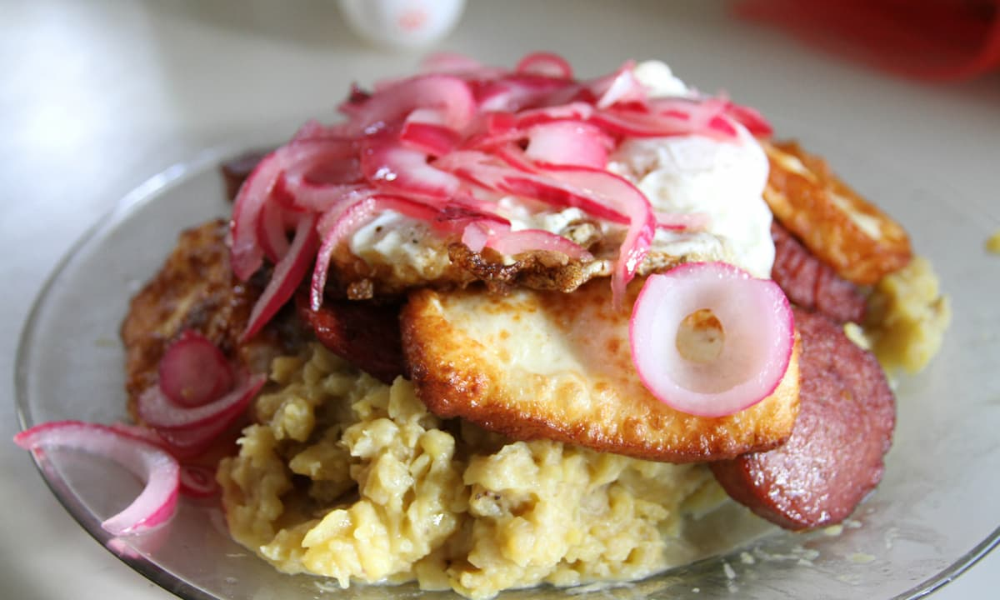

# 🍽 Mangú

<p align="">
  
  
  
  
  
</p>

My starter website built with <a href="https://www.11ty.dev/">11ty</a> and <a href="https://tailwindcss.com/">TailwindCSS</a>.

## 🚀 Deployments

I'm trying to learn some CI/CD by deploying this project to all these places:

- [Vercel](https://11ty-starter-chi.vercel.app/)
- [Cloudflare Pages](https://11ty-starter-4uy.pages.dev/)
- [GitHub Pages](https://miguelpimentel.do/11ty-starter/) _(styles are broken)_

## ⚙ Quick Start

**1. Clone the repo**

```bash
git clone git@github.com:semanticdata/mangu.git
```

**2. Install dependencies**

```bash
pnpm install
```

**3. Start it up**

```bash
pnpm start
```

**4. Open your browser to `https://localhost:8080/`**

## ✨ Features

- Blog section
- Notes section
- Wikilinks (`[[links]]`)
- Backlinks (with Hover Preview)

## Background

Mangú is a smooth green plantain based puree. It is usually eaten at breakfast as it is an inexpensive dish to prepare but at the same time it is tasty and perfect to help face a new working day.

Anecdotally, although it has not been proven, it is said that the name comes from the American invasion of the country, where the Americans, upon tasting the dish, said “man, this is good” and the Dominicans, who did not know English, ended up calling it “mangú“.

Although it is usually made with green bananas, there is a sweet version made with ripe bananas.

It is definitely a food that is rooted in the heart of the Dominican people, as it has played a very important role in the food and nutrition of all its inhabitants. Especially in times of crisis or in more economically depressed social classes. Read more in the Wikipedia [article](https://en.wikipedia.org/wiki/Mang%C3%BA).



## 🙌 Acknowledgements and Attributions

This work is heavily inspired by [jeremydaly/eleventy-tailwind-template](https://github.com/jeremydaly/eleventy-tailwind-template) and [binyamin/eleventy-garden](https://github.com/binyamin/eleventy-garden).

Fluid design is done with help from [Utopia](https://utopia.fyi/).

## © License

Source code in this repository is available under the [MIT License](LICENSE).
